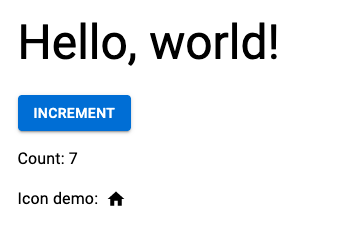

# Hello World in React, Material UI, and Parcel



This barebones example uses the latest version (v5 beta) of [Material-UI](https://next.material-ui.com/), "the world's most popular React UI framework", and the latest, "release candidate" (i.e. advanced beta) version of the [Parcel](https://v2.parceljs.org/) module bundler. _(21 Aug 2021)_

## Caveats

- I had some issues installing Parcel v2. Fixed them by `nvm install --latest-npm`.

## Tooling

Node Version Manager: run `nvm use` from repo root to use the Node version specified in `.nvmrc`.

Prettier formatting:

```bash
npm i -g prettier
npm run format
```
